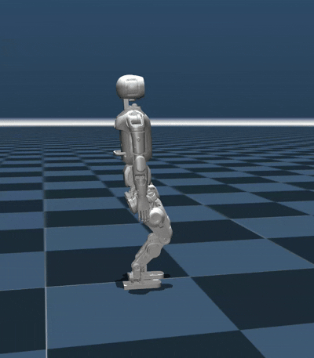

<div align="center">
  <h1 align="center">Cyan RL GYM</h1>
</div>
<div align="center"> 


</div>

## Installation and Configuration

Please refer to [setup.md](setup.md) for installation and configuration steps.

## Trainning and Testing

### 1. Train

Run the following command to start training:

```bash
python legged_gym/scripts/train.py --task=xxx
```

#### Parameter Description
- `--task`: Required parameter; values can be (orca).
- `--headless`: Defaults to starting with a graphical interface; set to true for headless mode (higher efficiency).
- `--resume`: Resume training from a checkpoint in the logs.
- `--experiment_name`: Name of the experiment to run/load.
- `--run_name`: Name of the run to execute/load.
- `--load_run`: Name of the run to load; defaults to the latest run.
- `--checkpoint`: Checkpoint number to load; defaults to the latest file.
- `--num_envs`: Number of environments for parallel training.
- `--seed`: Random seed.
- `--max_iterations`: Maximum number of training iterations.
- `--sim_device`: Simulation computation device; specify CPU as `--sim_device=cpu`.
- `--rl_device`: Reinforcement learning computation device; specify CPU as `--rl_device=cpu`.

**Default Training Result Directory**: `logs/<experiment_name>/<date_time>_<run_name>/model_<iteration>.pt`

---

### 2. Play

To visualize the training results in Gym, run the following command:

```bash
python legged_gym/scripts/play.py --task=xxx
```

**Description**:

- Play’s parameters are the same as Train’s.
- By default, it loads the latest model from the experiment folder’s last run.
- You can specify other models using `load_run` and `checkpoint`.

#### Export Network

Play exports the Actor network, saving it in `logs/{experiment_name}/exported/policies`:
- networks are exported as `policy_1.pt` or `policy_1.onnx`.
- You can move the exported checkpoint to `sim2sim_test/ckpt` for sim2sim.
### 3. Sim2Sim test (Mujoco)

Run Sim2Sim in the Mujoco simulator:

```bash
python sim2sim_test/sim2sim_mujoco/sim2sim_mujoco.py orca.yaml
```

### 4. Sim2Real test (Physical Deployment)
We use ros2 and lcm for real implementation. 
Here is a brief summary of the steps.
- Install [ros2](https://github.com/ros2), [Eigen](https://github.com/PX4/eigen) and [LCM](https://github.com/lcm-proj/lcm).

- Create a ros2 workspace.(We use humble for example)
```bash
source /opt/ros/humble/setup.bash
mkdir -p ~/ros2_ws/src
cd ~/ros2_ws/src
```
- Download the following packages which contains the sim2real code and relative dependencies.
```bash
git clone https://github.com/Algernon-Farm/cyan_sim2real.git
```
- build and run the project.
```bash
cd ~/ros2_ws
colcon build 
source install/setup.bash
ros2 run  simple_walk_controller simple_walk_controller --ros-args --params-file src/simple_walk_controller/params/params.yaml

```
Make sure the lowlevelsdk has been launched before running the above code for real implementation.

#### Replace Network Model
 Update the `model_path` in the YAML configuration file according to your model export path.


## Acknowledgments
This repository is built upon the support and contributions of the following open-source projects. Special thanks to:

- [legged\_gym](https://github.com/leggedrobotics/legged_gym): The foundation for training and running codes.
- [rsl\_rl](https://github.com/leggedrobotics/rsl_rl.git): Reinforcement learning algorithm implementation.
- [mujoco](https://github.com/google-deepmind/mujoco.git): Providing powerful simulation functionalities.


## License

This project is licensed under the [BSD 3-Clause License](./LICENSE):
1. The original copyright notice must be retained.
2. The project name or organization name may not be used for promotion.
3. Any modifications must be disclosed.

